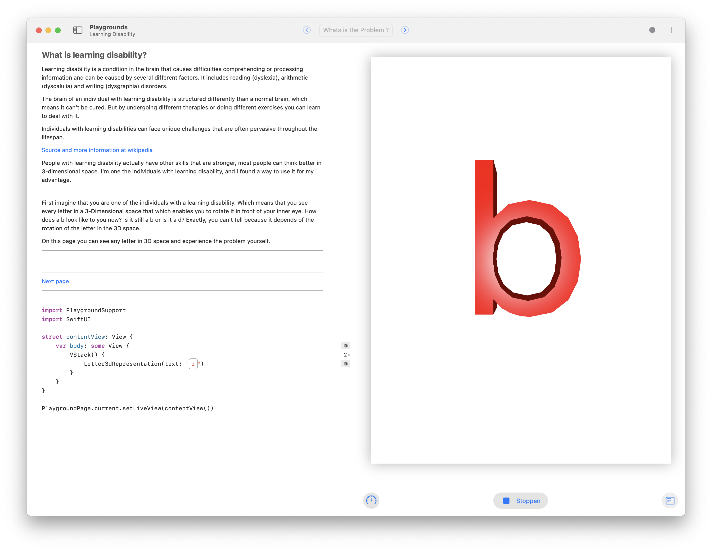
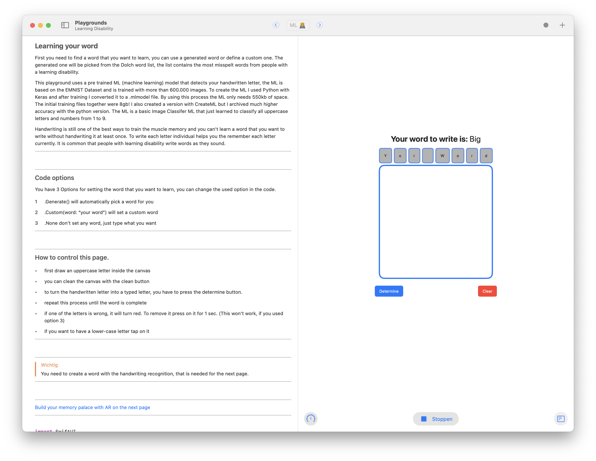
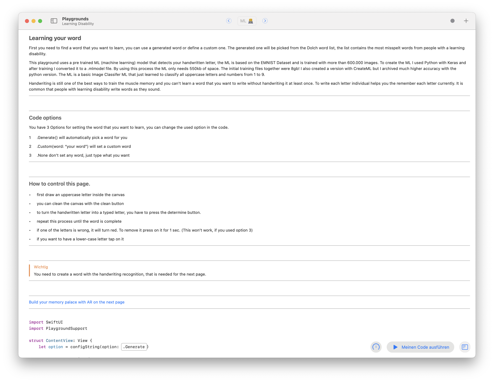

# Learning Disability 

This project is my wwdc 2020 student challenge project. I tried to explain what learning disability is and what my way is to solve it. 

Youtube: https://youtu.be/8qhFrv4MEPg

#  Learning your word

 First you need to find a word that you want to learn, you can use a generated word or define a custom one. The generated one will be picked from the Dolch word list, the list contains the most misspelt words from people with a learning disability.
 
  This playground uses a pre trained ML (machine learning) model that detects your handwritten letter, the ML is based on the EMNIST Dataset and is trained with more than 600.000 images. To create the ML I used Python with Keras and after training I converted it to a .mlmodel file. By using this process the ML only needs 550kb of space. The initial training files together were 8gb! I also created a version with CreateML but I archived much higher accuracy with the python version. The ML is a basic Image Classifer ML that just learned to classify all uppercase letters and numbers from 1 to 9.
 
Handwriting is still one of the best ways to train the muscle memory and you can't learn a word that you want to write without handwriting it at least once. To write each letter individual helps you the remember each letter currently. It is common that people with learning disability write words as they sound.
 

## Code options

You have 3 Options for setting the word that you want to learn, you can change the used option in the code.

1. .Generate() will automatically pick a word for you
2. .Custom(word: “your word”) will set a custom word
3. .None don’t set any word, just type what you want

 ## How to control this page.
 
- first draw an uppercase letter inside the canvas
 - you can clean the canvas with the clean button
 - to turn the handwritten letter into a typed letter, you have to press the determine button.
 - repeat this process until the word is complete
 - if one of the letters is wrong, it will turn red. To remove it press on it for 1 sec. (This won’t work, if you used option 3)
 - if you want to have a lower-case letter tap on it

#  Learning your word

 First you need to find a word that you want to learn, you can use a generated word or define a custom one. The generated one will be picked from the Dolch word list, the list contains the most misspelt words from people with a learning disability.
 
  This playground uses a pre trained ML (machine learning) model that detects your handwritten letter, the ML is based on the EMNIST Dataset and is trained with more than 600.000 images. To create the ML I used Python with Keras and after training I converted it to a .mlmodel file. By using this process the ML only needs 550kb of space. The initial training files together were 8gb! I also created a version with CreateML but I archived much higher accuracy with the python version. The ML is a basic Image Classifer ML that just learned to classify all uppercase letters and numbers from 1 to 9.
 
Handwriting is still one of the best ways to train the muscle memory and you can't learn a word that you want to write without handwriting it at least once. To write each letter individual helps you the remember each letter currently. It is common that people with learning disability write words as they sound.

## Code options

You have 3 Options for setting the word that you want to learn, you can change the used option in the code.

1. .Generate() will automatically pick a word for you
2. .Custom(word: “your word”) will set a custom word
3. .None don’t set any word, just type what you want

 #  Build your memory palace 🧠
 
 Do you know Schlerock Holems ? Maybe he is the most known person that useses a memory palace. The methord to member things with the help of a memeory palace is a also known as the "Method of loci" and was first described in 1966.
 
 ## But what is a memory palace ?
 
The Memorial Palace is a place you make up your own mind. It can be every thing, for example your office. Inside your palace you can create rooms for each object that you want to remember. The goal is that you visulise thise things. It is proven that you remeber images better than written things, espacily for some one with learning disability. The old method to get started with visualie things is with clay.
 
 ## Therapy for people with learnning disability
 
 It is a well known therapy for people with lerning disability to create a picture with clay for it, for example a Person is before a table. The word is before. They also need to write the word with clay and put it to the picture. That needs to rember the word and how it is written. The closed expirance that I could build is with the handwriting recognition on page 2 and this AR scene. I have used the clay therapy and it helped me a lot to improve my writing.
 
 ## Build a memory palace with AR 🧱
 
With modern technologie we can visulise the memory palace with AR, I created a a floating island as your memory palace. You can pick different object and arange them like you want to visulise your word. I will use the word that you wrote on page 2 to as Text. Because we are creating a 3D object that usaly has a clear perspective to look at it we can solve the issue from page 1 with it. The person can new look at the object and can see where the front is and from where he needs to look to write the word correctly.
  

 - Important:
 you should place your word as text on the island to keep conncet it inside your meomry with your image.

  ### Tips for AR:
 
 - The most important thing is that you get up and move around to play with the AR. That does not only help you to build your island that also helps you to keep you island in memory.
 
 - close every video that is playing inside picutre in picture mode, if you don't do that the screen will be black.

 - please not use the full screen mode, this creashes somethimes the playground.
 
 - have some distance beween your and the island (around 3 foot). The Raycasting (object positon) works than best.
 

 ### Your Tasks:
1. Build your "room" on the island to visulise your word.
2. Add the word as text to the "room"
3. Turn on repeatScene to build your island again to keep it better in memeory.

 - Note:
  I wanted to have a more raycast tracking but it creashed the playground. That is why you new need to move the object to the exact location after you added it to the scene.

  Also I needed to create every model with Blender and Vectory my self, every model that I found online is to big for a playground and it crashes immediately. It is the first time that I created 3D assets my self. Because of this the models are not very complicated what is perfect for a playground 😁.

